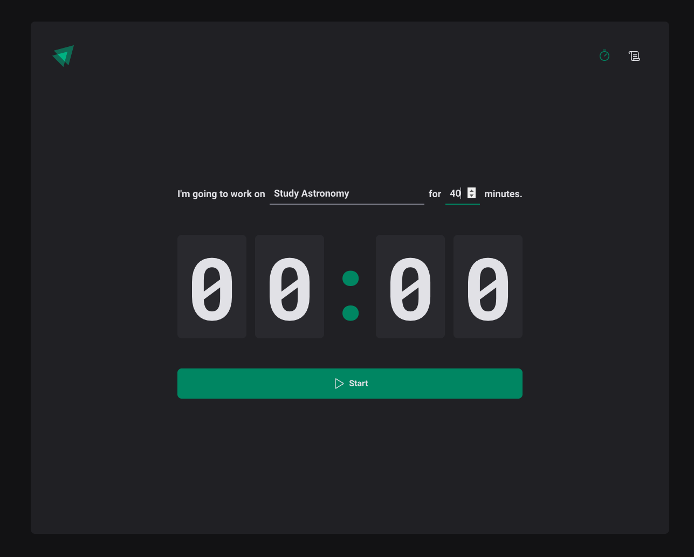
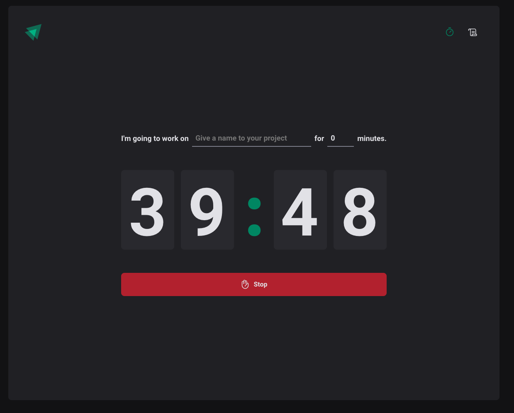
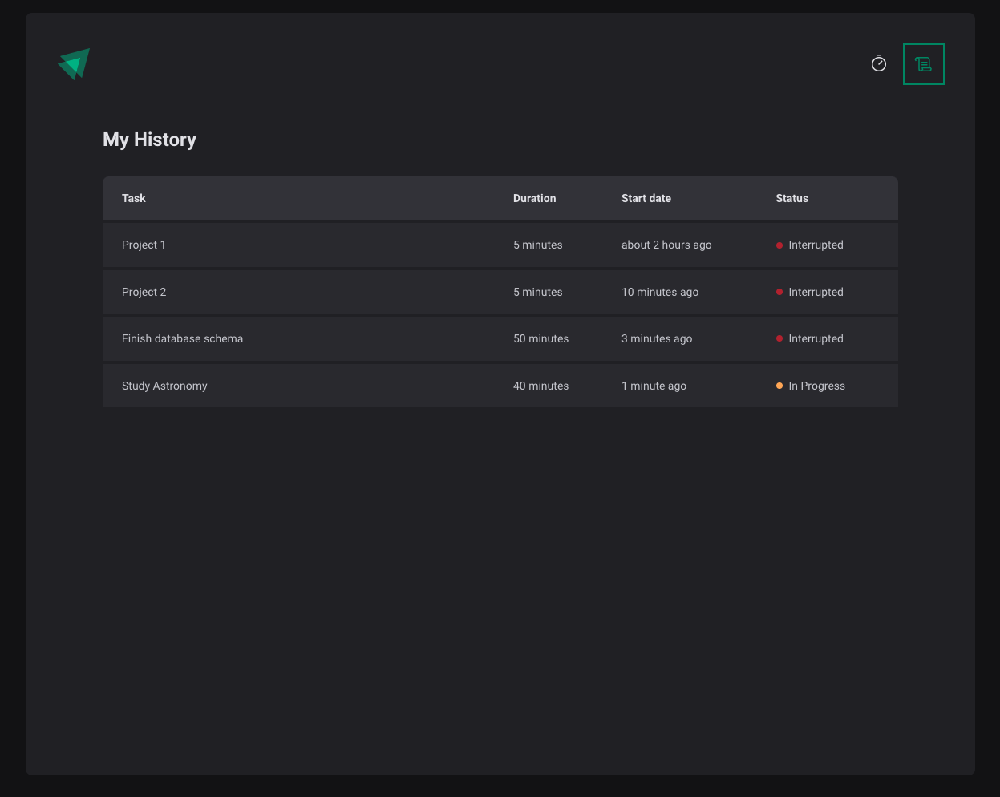

<h1 align="center">Pomobreak</h1>

  

## About
React app that uses the Pomodoro technique to set a timer for your daily activities. User is able to create a task and keep track of previous tasks states, such as In Progress, Interrupted or Completed.

## ✨ Live project
<a href="https://luizpelegrini.github.io/pomobreak/" target="_blank">https://luizpelegrini.github.io/pomobreak</a>

 

### 🧑‍💻 What I learn
* Usage of `styled-components` for styling.
* Usage of `react-hook-form` and `zod` for form handling and validation.
* Navigate between pages using `react-router-dom`
* Store shared information using React Context API
* Usage of React reducers to manipulate complex component state

 

---

 

    <b>Mobile</b>

  

    <b>Desktop</b>

    

    <b>Desktop</b>

    

 

---

 

## 🚀 How to run:

- Clone this repository.
- Run `npm install`.
- Run `npm run dev` to start the local server.
